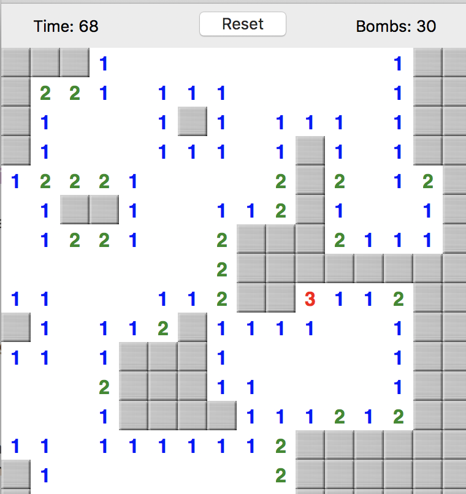

==============
Minesweeper JS
==============

In this exercise, you'll add features to a very barebones Minesweeper
game to make it more full-featured.

Step 0: Play the Solution
=========================

Play the provided game, to get a feel for how it should work:

- on a 11x11 board, there are 11 hidden mines

- clicking on a cell reveals that cell *and* its neighbors:

  - until it hits a cell next to a mine, in which case it
    stops revealing in that direction

  - cells show you how many mines are next to them

  - clicking on a mine ends the game in a loss

  - revealing all non-mine cells wins the game

You can play the solution by opening the HTML file
in the solution folder.

Step 1: Read the Code
=====================

**Carefully read the code; there's a lot of subtlety here**.
In particular, pay attention to the algorithm that reveals cells
when you click on them.

- Add comments to document the purpose of functions and
  particular parts of the code.

Step 2: Make the Game Winnable
==============================

The current version *works* -- but there's no winning condition.

The game should end in a win when all non-mine cells are revealed.

Add code that determines if the game has been won and:

- prevents further clicking on cells
- shows a winning message

Possible Feature: Flags
=======================

Add a "flag" feature to the game.

In the normal versions of Minesweeper, you can right-click on
a cell to "flag it" (you normally do this because you've deduced
or suspect that it is a mine). This doesn't reveal the cell, but, instead,
marks it with a flag icon. 

Add a feature to handle flagging cells. You can have this be from
right-clicking or by holding down a key (like "f" while clicking on
a cell)

Possible Feature: Undo
======================

Some people like to play Minesweeper as more of a relaxing puzzle
than a challenging one, and find it frustrating when they lose a game
by clicking on one cell.

Add a feature that allows you the user to "undo" their last click.

Possible Feature: Better UX
===========================

The game UX right now is very bare-bones:

- you cannot configure how big the board is, or how many mines there
  will be

- The win/lose messages are just simple pop-up alerts

- There's no way to restart a game or play again

- There's no way to time yourself 

Add some or all of these UX features.

Possible Feature: Better Look & Feel
====================================

The appearance of the game is also very spartan.

The full game has 3d-appearing beveled cells, bomb icons, explosion
icons for the bomb that was set up, flag icons for the flags, etc.

Add some of these!

